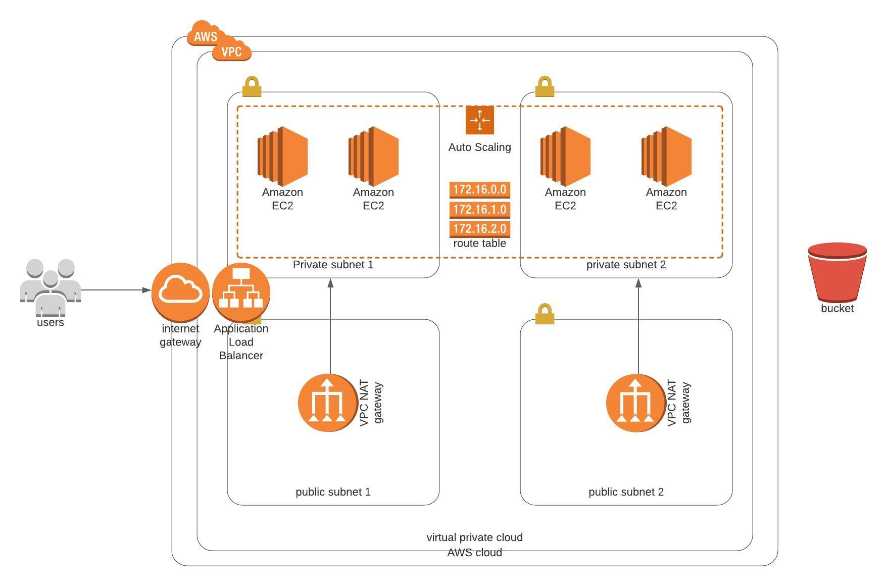

# learn-cloudFormation
This project is just a toy project. I use this repository to learn cloud devOps. The cloud formation scripts in this repository is building the infrastructure below.
run `network-update.sh` to update network.yaml and `servers-update.sh` to run an update on servers.yaml.

